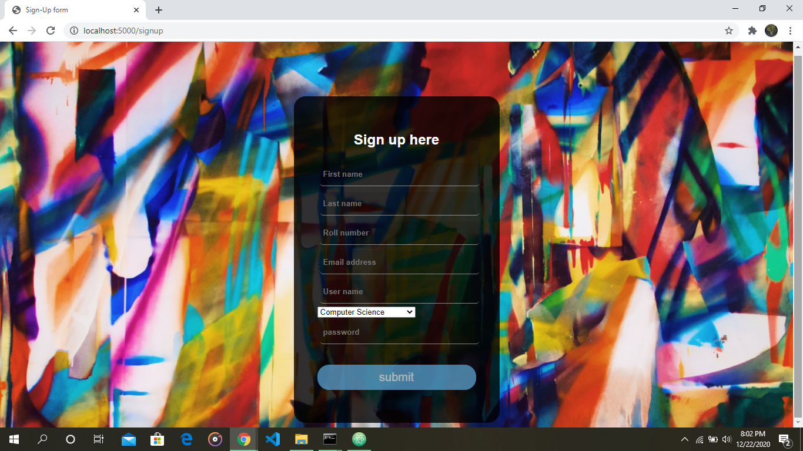
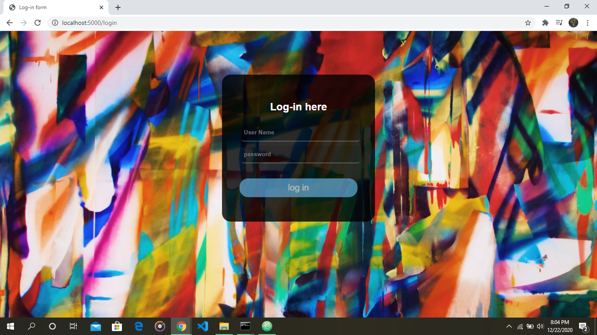
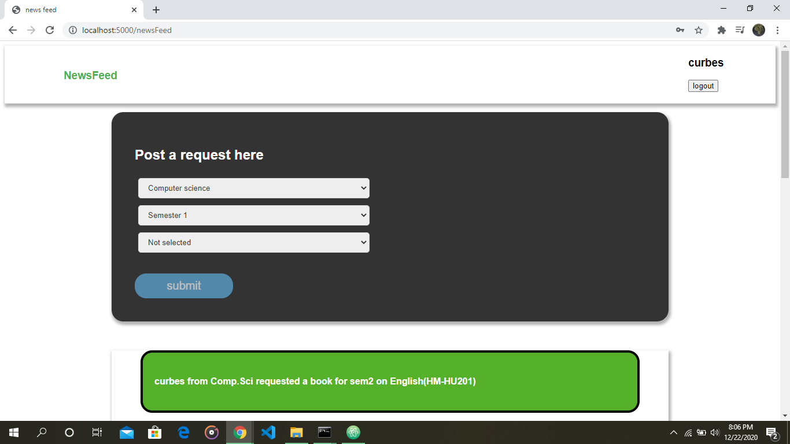
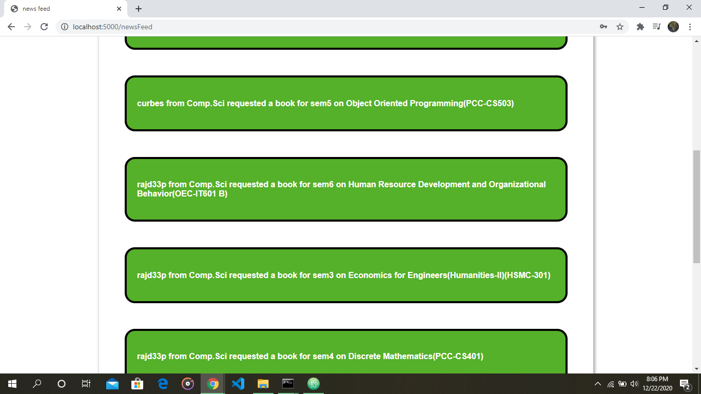
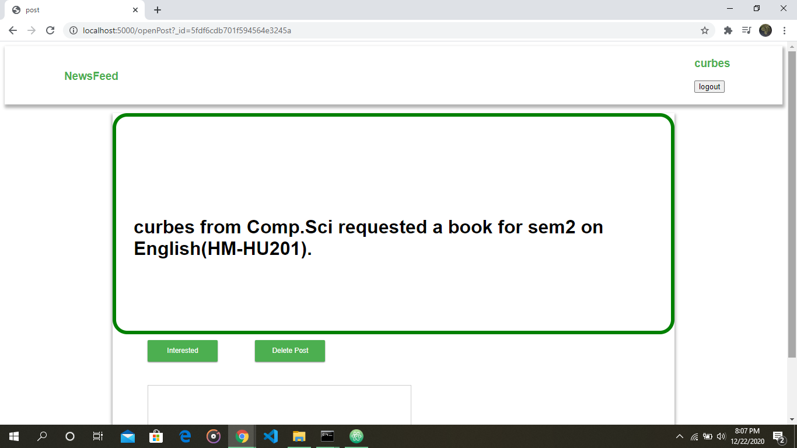
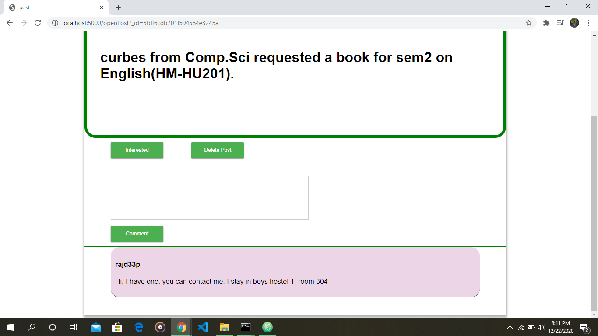
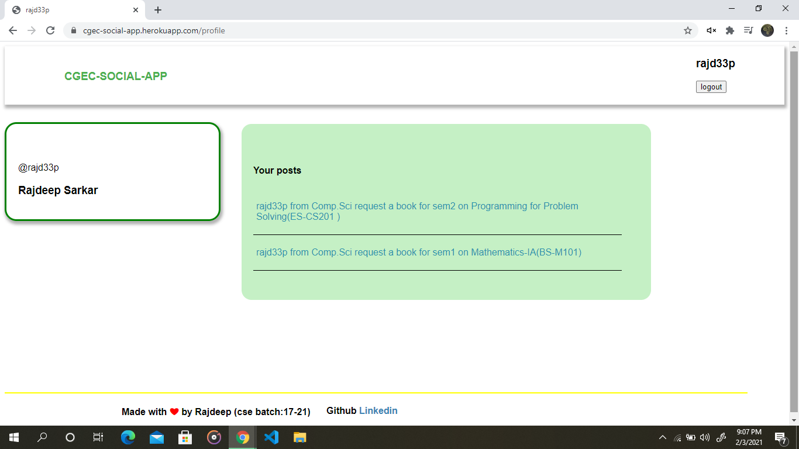

# cgec-social-app

https://cgec-social-app.herokuapp.com/

A web app to communicate between the students of Coochbehar Government Engineering College to share common necessities, such as books, drawing kit, lab stuffs etc.
It has a sign-up form for new students to register. It will verify the students by sending an email to the given email address during the sign up process. I have used nodemailer module for this purpose. 

After verification students can log-in using their username and password. I have used bCryptjs module for hashing the passwords. 

After a successful log-in it will take you to the home page where all the request will be loaded by a ajax call to the server. And fill up 10 requests per page. 
It will also have a request maker on the top of the page. 

Clicking on a post, the post will be loaded. and details such as people interested in it, comments on the post will also appear. Only for the post owner the delete post button will be seen.

A text area for writing down a comment and clicking the comment button will add the comment to this post. Again, owner of the comment will have the access to delete the comment. 

Clicking on the username(right above the logout button) the profile page for the user will load up. Where all the details about the user will be found. and the posts made by the user will load up.

## Features to be added
 
1. Image uploading options for user to upload images.
2. A chat box for users to chat.
